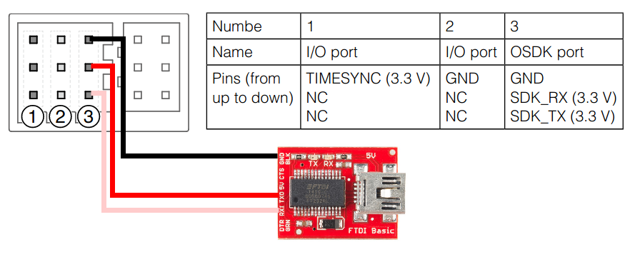
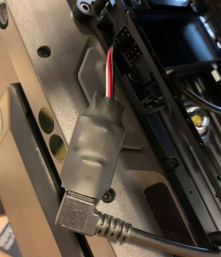
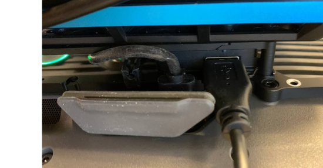
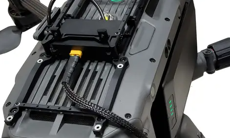

# Getting started

## Configuration

### Hardware configuration 
Various methods exist to connect each dji drones to companion computers, and the approach varies depending on the drone model and the companion computer in use. Below is a table outlining the potential connection configurations . For the most recent updates, please refer to the latest version of the [table](https://developer.dji.com/doc/payload-sdk-tutorial/en/quick-start/drone-port.html).

| Aircraft       | Port Name                | Adapted Development Kit                                                                                        |
|----------------|--------------------------|----------------------------------------------------------------------------------------------------------------|
| Matrice 3D/3TD | E-Port                   | [E-Port Development Kit](https://store.dji.com/cn/product/dji-e-port-development-kit)                          |
|                | E-Port Lite              | [E-Port Development Kit](https://store.dji.com/cn/product/dji-e-port-development-kit)                          |
| FlyCart 30     | E-Port Lite              | -                                                                                                              |
| M350 RTK       | E-Port                   | [E-Port Development Kit](https://store.dji.com/cn/product/dji-e-port-development-kit)                          |
|                |                          | [SDK Round Ribbon Cable](https://store.dji.com/product/osdk-round-ribbon-cable-set)                            |
|                | PSDK Port (Gimbal Port)  | [SkyPort V2 Development Kit](https://store.dji.com/product/psdk-development-kit-v2)                            |
|                |                          | [SkyPort V2 Production Suit](https://store.dji.com/product/dji-skyport-adapter-set-v2)                         |
|                |                          | [DJI X-Port](https://store.dji.com/product/dji-x-port)                                                         |
| Mavic 3E/3T    | E-Port                   | [E-Port Development Kit](https://store.dji.com/cn/product/dji-e-port-development-kit)                          |
| Matrice 30/30T | E-Port                   | [E-Port Development Kit](https://store.dji.com/cn/product/dji-e-port-development-kit)                          |
| M300 RTK       | OSDK Port                | [E-Port Development Kit](https://store.dji.com/cn/product/dji-e-port-development-kit)                          |
|                |                          | [SDK Round Ribbon Cable](https://store.dji.com/product/osdk-round-ribbon-cable-set)                            |
|                |                          | [OSDK Expansion Module(Not recommended)](https://store.dji.com/product/matrice-300-rtk-osdk-expansion-module)  |
|                | PSDK Port (Gimbal Port)  | [SkyPort V2 Development Kit](https://store.dji.com/product/psdk-development-kit-v2)                            |
|                |                          | [X-port](https://store.dji.com/product/dji-x-port)                                                             |
|                |                          | [SkyPort V1 Development Kit](https://store.dji.com/product/psdk-development-kit)                               |
|                |                          | [SkyPort V1 Production Suit](https://store.dji.com/product/dji-skyport-adapter-set)                            |


#### OSDK Expansion Module
This connection is compatible exclusively with the M300 RTK drone. Upon establishing the connection, two devices will be recognized by the computer: one for serial communication and the other for network communication. To maintain consistent device naming across sessions, refer to the 'Udev rules' section, which provides guidance on preventing device name alterations each time the devices are connected.

* Steps

1. Connect the FTDI adapter to the designated pins on the OSDK Exapansion module for serial communication:



2. Use a mini-USB A to USB A cable (this cable is different depending on the ftdi module you use) to connect the FTDI adapter to the computer's USB 2.0 port:



3. Connect the USB A to USB A from the OSDK Expansion module to the USB port of the computer:



4. Connect the power cable from the OSDK Expansion module to supply power to the companion computer:



<div style="background-color: #FFDDB8; padding: 10px; border: 0.2px solid ##FBFAFA;">
    <p style="margin: 0;"><strong> Caution:</strong>  The OSDK expansion module outputs 24V. Ensure that your companion computer can tolerate this voltage level. If not, you must use an appropriate step-down module to reduce the voltage to a safe level for your device.</p>
</div>
<div style="margin-bottom: 20px;"></div>

#### E-Port

Before launching the psdk_ros2 wrapper, you must ensure that you are using the proper hardware connection to the DJI drone. Please be aware that each drone model and companion computer may require a different connection type. Refer to the instructions provided by DJI here: [Aircraft Hardware Connection](https://developer.dji.com/doc/payload-sdk-tutorial/en/quick-start/device-connect.html). Ensure the necessary setup on your board is performed to enable both serial and network communication. You can find some examples on how to do that here: [E-Port Quick Start](https://developer.dji.com/doc/payload-sdk-tutorial/en/quick-start/quick-guide/jetson-nano.html). We advise to first try and run the DJI sample code, and only afterwards run the psdk_ros2 wrapper. 

Once you've established the hardware connection between your board and the DJI drone, you can configure the psdk_ros2 wrapper to utilize that setup through the  *psdk_wrapper/cfg/link_config.json* file. This file follows a similar strategy to the file one must configure before running the DJI PSDK samples. Please notice, that the App configuration (e.g. app_id, app_key) has been kept in the ros parameter file (cfg/psdk_params.yml). 

### ROS 2 Parameter configuration

The following parameters can be configured in the *psdk_wrapper/cfg/psdk_params.yaml* file:

| Parameter                     | Data Type | Default Value                      | Comments                                    |
| ------------------------------| --------- | ---------------------------------- | ------------------------------------------- |
| app_name                      | String    | -                                  | Add your App name                           |
| app_id                        | String    | -                                  | Add your App id                             |
| app_key                       | String    | -                                  | Add your App key                            |
| app_license                   | String    | -                                  | Add your App license                        |
| developer_account             | String    | -                                  | Add your developer account (not mandatory)  |
| baudrate                      | String    | 921600                             | -                                           |
| num_of_initialization_retries | Int       | 1                                  | Num of retries to init the PSDK app         |
| tf_frame_prefix               | String    | TF frame prefix                    | Add prefix before the frame name            |
| imu_frame                     | String    | "psdk_imu_link"                    | -                                           |
| body_frame                    | String    | "psdk_base_link"                   | -                                           |
| map_frame                     | String    | "psdk_map_enu"                     | -                                           |
| gimbal_frame                  | String    | "psdk_gimbal_link"                 | -                                           |
| camera_frame                  | String    | "psdk_camera_link"                 | -                                           |
| mandatory_modules             |           |                                    |                                             |
| - telemetry                   | Bool      |  True                              | Trigger node failure, if module not loaded  |
| - flight_control              | Bool      |  True                              | Trigger node failure, if module not loaded  |
| - camera                      | Bool      |  False                             | Trigger node failure, if module not loaded  |
| - gimbal                      | Bool      |  False                             | Trigger node failure, if module not loaded  |
| - liveview                    | Bool      |  False                             | Trigger node failure, if module not loaded  |
| - hms                         | Bool      |  False                             | Trigger node failure, if module not loaded  |
| data_frequency                | Object    | -                                  | Options are: 1, 5, 10, 50, 100, 200, 400 Hz |
| - imu                         | Integer   | 100                                | -                                           |
| - attitude                    | Integer   | 100                                | -                                           |
| - acceleration                | Integer   | 50                                 | -                                           |
| - velocity                    | Integer   | 50                                 | -                                           |
| - angular_velocity            | Integer   | 100                                | -                                           |
| - position                    | Integer   | 50                                 | -                                           |
| - altitude                    | Integer   | 50                                 | -                                           |
| - gps_data                    | Integer   | 1                                  | -                                           |
| - rtk_data                    | Integer   | 1                                  | -                                           |
| - magnetometer                | Integer   | 50                                 | -                                           |
| - rc_channels_data            | Integer   | 1                                  | -                                           |
| - gimbal_data                 | Integer   | 1                                  | -                                           |
| - flight_status               | Integer   | 1                                  | -                                           |
| - battery_level               | Integer   | 1                                  | -                                           |
| - control_information         | Integer   | 1                                  | -                                           |
| - esc_data_frequency          | Integer   | 1                                  | -                                           |

## Running the psdk_ros2 wrapper

### Debian packages for ROS 2 Humble

```bash
# Install debians
sudo apt install ros-humble-psdk-wrapper ros-humble-psdk-interfaces
source /opt/ros/humble/setup.bash

# Launch the node
# Default link_config_file_path = /opt/ros/humble/share/psdk_wrapper/cfg/link_config.json
# Default psdk_params_file_path = /opt/ros/humble/share/psdk_wrapper/cfg/psdk_params.yaml
# If using parameter and config files different than the default ones, you can point to them as:
ros2 launch psdk_wrapper wrapper.launch.py link_config_file_path:=/absolute/path/to/config.json psdk_params_file_path:=/absolute/path/to/params.yml
 
```

### Compile from source

To use the psdk_ros2 wrapper you will need to create a new workspace in which you clone both the wrapper as well as the Payload-SDK libraries. 

```bash
mkdir -p ~/psdk_ros2_ws/src
cd ~/psdk_ros2_ws/src
# Clone the psdk_ros2 wrapper
git clone https://github.com/umdlife/psdk_ros2.git

# Before building, check the Dependencies section and make sure you have everything installed
# You can also run rosdep to automatically install the dependencies
rosdep update
rosdep keys --from-paths . --ignore-src --rosdistro humble | \
  xargs rosdep resolve --rosdistro humble | \
  awk '/#apt/{getline; print}' > ./rosdep_requirements.txt
sudo apt install -y --no-install-recommends $(cat ./rosdep_requirements.txt) 

# Build the code
cd ~/psdk_ros2_ws
colcon build

# Launch the node
ros2 launch psdk_wrapper wrapper.launch.py

# Default link_config_file_path = psdk_wrapper/cfg/link_config.json
# Default psdk_params_file_path = psdk_wrapper/cfg/psdk_params.yml
# If using parameter and config files different than the default ones, you can point to them as:
ros2 launch psdk_wrapper wrapper.launch.py link_config_file_path:=/absolute/path/to/config.json psdk_params_file_path:=/absolute/path/to/params.yml

```

## Udev rules

To avoid changing the device name each time you run the psdk application, you can use the following udev rules

```bash
# DJI Serial Comm
SUBSYSTEM=="tty", SUBSYSTEMS=="usb", ATTRS{idVendor}=="YourVendor", ATTRS{idProduct}=="YourProduct", MODE="0666", SYMLINK+="dji_serial"
# DJI Advanced Sensing
SUBSYSTEM=="tty", SUBSYSTEMS=="usb", ATTRS{idVendor}=="YourVendor", ATTRS{idProduct}=="YourProduct", MODE="0666", SYMLINK+="dji_advanced_sensing"
```


## Dependencies 

### ROS 2 packages

The following ROS 2 packages are needed to successfully build the wrapper:

* rclcpp
* rclcpp_lifecycle
* tf2
* tf2_ros
* sensor_msgs
* geometry_msgs
* std_msgs
* nav_msgs
* std_srvs

### Other libraries

The following libraries are needed to enable the access to USB devices and handling the video streaming:

* libusb-1.0-0-dev
* libopus-dev 
* ffmpeg 
* libavcodec-dev 
* libavformat-dev 
* libavfilter-dev

The following library is used to work with JSON:
* nlohmann-json-dev
